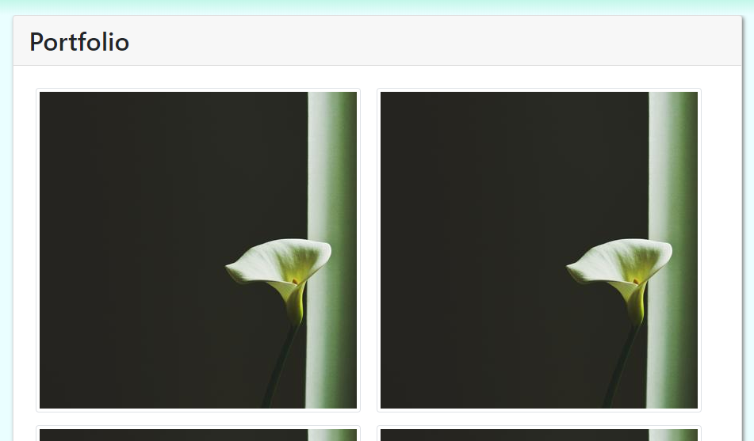

# Portfolio

## Overview

This my a professional portfolio, [deployed on GitHub](https://nvanbaak.github.io/profile-page/) until I get around to hosting it on my Raspberry Pi.

Current contents:

* A home page with an About Me section
* A Portfolio page with selected projects

##  Responsive Web Design

A key objective for this project was making the web pages mobile-responsive.  This mattered most in two cases: the collapsible navbar, and the porfolio page.

### Collapsing navbar

### Responsive Portfolio

## View the website here:

> https://nvanbaak.github.io/profile-page/
