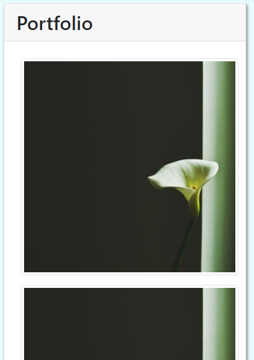

# Portfolio Proof of Concept

## Overview

This project was half preparation for professional development down the road and half an excuse to join the modern web by learning Bootstrap.  I created and formatted three web pages:

* A home page with an About Me section
* A Portfolio page that could host placeholder images for future projects
* A Contact page using Bootstrap's custom form features

##  Responsive Web Design

A key objective for this project was making the web pages mobile-responsive.  This mattered most in two cases, the collapsable navbar, and the porfolio page.

### Collapsing navbar

### Responsive Portfolio

